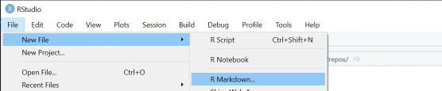
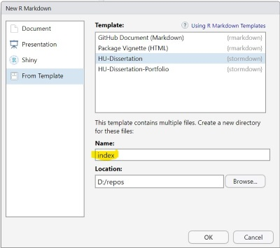
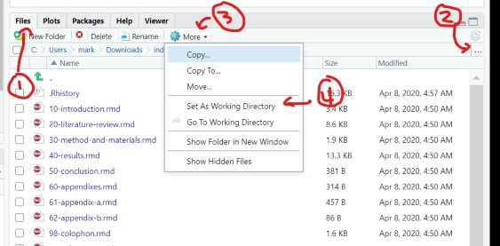

# Using `stormdown` to write your Ph.D. dissertation

This walkthrough guides you through the process of how to use `stormdown` to write your Ph.D. dissertation.
It should cover everything you should need to get started from a brand-new PC.
If it does not, add an issue to the backlog or submit a PR.
If you have been using your PC for a while, the chances are that most of the work is already done.
Feel free to skip steps you do not need (like installing R).
This guidance is Windows-centric, but similar steps should run on Mac or Linux.
The version numbers for the packages I use are noted.
If you use a different version, YMMV.

When testing these steps, I started from a new [VM in Azure](https://github.com/markanewman/DoTheThing/tree/master/SimpleDataScienceVM).
If you find something that does not work, you may need to fiddle with your install base.
Assuming there is enough interest, I will put up a troubleshooting FAQ.

01. Setup the prerequisites.    
    * [R](https://cran.r-project.org/bin/windows/base/) (3.6.3) + [R Studio](https://www.rstudio.com/products/rstudio/download/) (1.2.5033)
    * [RTools](https://cran.r-project.org/bin/windows/Rtools/) (3.5.0.4)
    * I recommend using [Chocolatey](https://chocolatey.org/install), but you can use any method you like.
      Open a Powershell prompt in admin mode and run the below commands.
```{ps1}
if('Unrestricted' -ne (Get-ExecutionPolicy)) { Set-ExecutionPolicy Bypass -Scope Process -Force }
iex ((New-Object System.Net.WebClient).DownloadString('https://chocolatey.org/install.ps1'))
refreshenv
choco install r.project --version=3.6.3 -y
refreshenv
choco install r.studio --version=1.2.5033 -y
choco install rtools --version=3.5.0.4 -y
```
02. Open up [R Studio][rstudio]
03. Install the R packages: `rmarkdown` (2.3), `bookdown` (0.20), `tinytex` (0.24), `devtools` (2.3.0), `kableExtra` (1.1.0), `dplyr` (1.0.0), and `ggpubr` (0.3.0).
    * `kableExtra`, `rlang`, `dplyr`, and `ggpubr` are only used in the sample sections.
      You only need them to test the inital Knit.
    * In order to pin the version of the packages, set the repo to a snapshot version.
```{r}
r <- getOption('repos')
r['CRAN'] <- 'https://mran.microsoft.com/snapshot/2020-06-24'
options(repos = r)
install.packages(c('rmarkdown', 'bookdown', 'tinytex'))
install.packages(c('devtools'))
install.packages(c('kableExtra', 'dplyr', 'ggpubr'))
```
04. Install LaTeX.
    There will be a couple of popups complaining about missing DLLs, ignore those.
```{r}
tinytex::install_tinytex()
```
05. Restart [R Studio][rstudio] then run the following to test the LaTeX install.
```{r}
tinytex:::is_tinytex()
```
06. Install `stormdown` then restart [R Studio][rstudio]
    `rtools` won't work if there is no timezone set, so that may need done too.
```{r}
if(Sys.timezone() == 'unknown') { Sys.setenv(TZ = 'GMT') }
devtools::install_github('markanewman/stormdown', upgrade = 'never')
```
07. Restart [R Studio][rstudio] to refresh the template cache.
08. Create your files.
    File -> New File -> R Markdown... then choose 'From template', then choose 'HU-Dissertation, and enter `index` as the **Name** (_see Figures 1-2 below_).
    Note that this will currently only **Knit** if you name the directory `index` at this step.
    Please note: both the folder and the entry point `rmd` file are called index.
    The file name must remain `index.rmd`, but you may want to rename your directory to something more memorable. 
    * If you are not using [R Studio][rstudio], the below command line should help. 
      ```{r}
      #only if not running RStudio
      rmarkdown::draft('index', template = 'dissertation', package = 'stormdown', create_dir = T, edit = F)
      ```
09. Make sure your working directory is the same as the one you used to create the template.
    Files Tab -> Go To Folder -> More -> Set As Working Directory (_see Figure 3 below_).
    * If you are not using [R Studio][rstudio], the below command line should help. 
      ```{r}
      #only if not running RStudio
      setwd("index")
      ```
10. Knit the files.
    The first time you knit, it will take a long time as the system automatically puls down all the LaTeX packages.
    Subsequent knits will be much faster.
    * If you are not using [R Studio][rstudio], the below command line should help. 
      ```{r}
      #only if not running RStudio
      bookdown::render_book('index.rmd')
      ```
11. Enjoy.

Figure 1: Path to new templates <br/>

Figure 2: Create new template <br/>

Figure 3: Set working directory <br/>

[rstudio]: https://www.rstudio.com/
